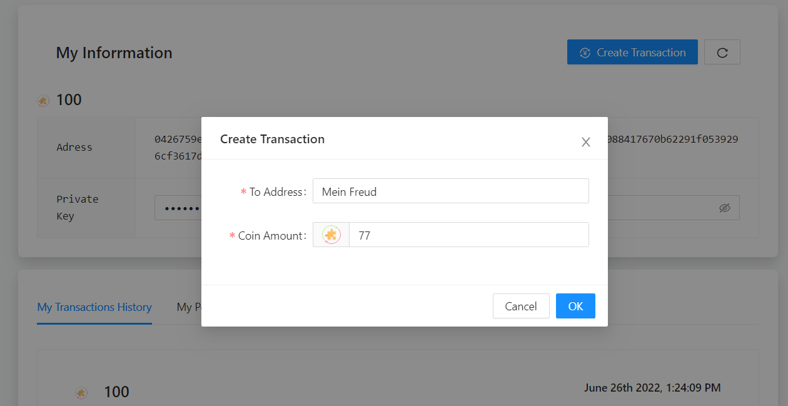
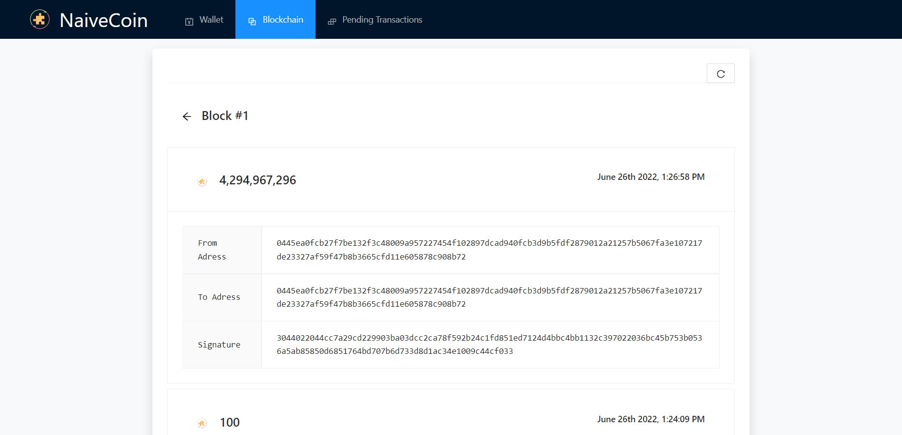

# NaiveCoin

A simple demonstration of blockchain.

Demo: https://youtu.be/AGXmlOKNXqQ

## How to run the app

1. Go to `backend` folder.

   1. Install dependencies: `npm i`
   2. Start the backend: `npm run deploy:prod`. The blockchain server should run and expose API at `localhost:3001`
   3. To stop the backend: `npm run stop`

   

2. Go to `frontend` folder

   1. Install dependencies: `npm i`
   2. Start the frontend: `npm start`. You can see the app is running at `loccalhost:3000`
   3. To stop the frontend: Simply `Ctrl + C` in your terminal twice

## References

Blockchain logic: [Savjee/SavjeeCoin: A simple blockchain in Javascript. For educational purposes only. (github.com)](https://github.com/Savjee/SavjeeCoin)

UI components: [Components Overview - Ant Design](https://ant.design/components/overview/)

UI Styling: [Get started with Bootstrap · Bootstrap v5.2](https://getbootstrap.com/docs/5.2/getting-started/introduction/)

UI State management: [README · MobX](https://mobx.js.org/README.html)